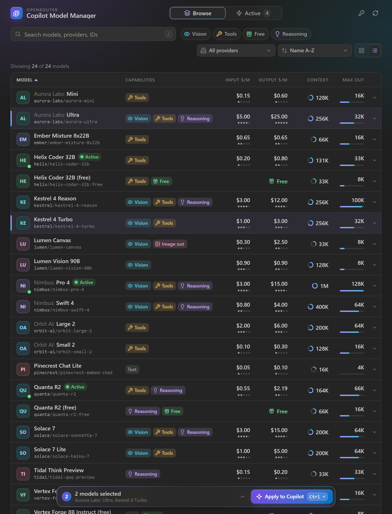
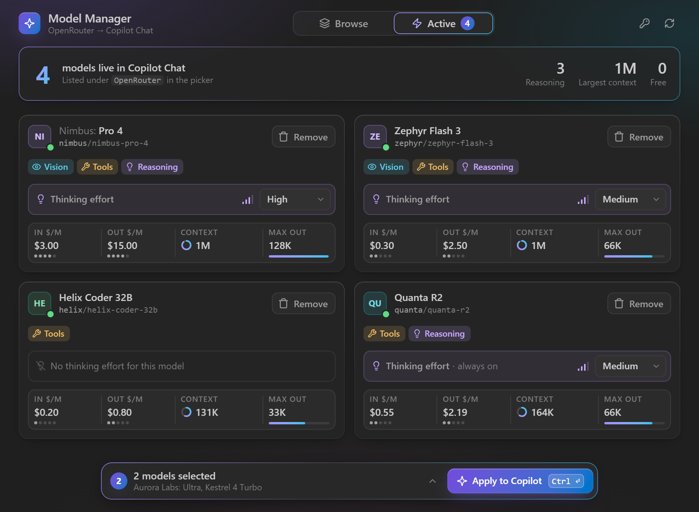
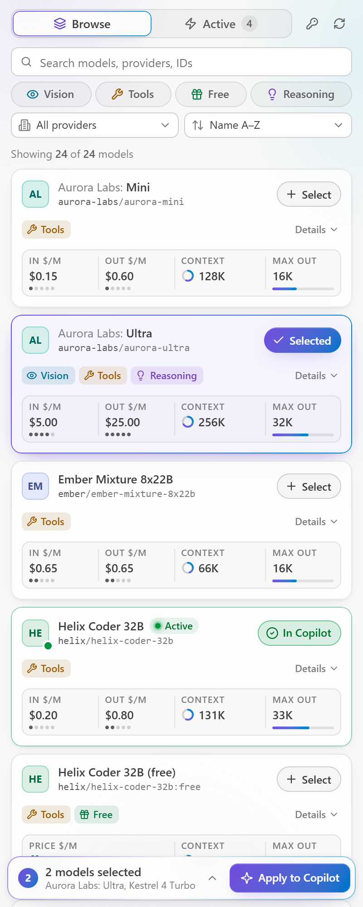
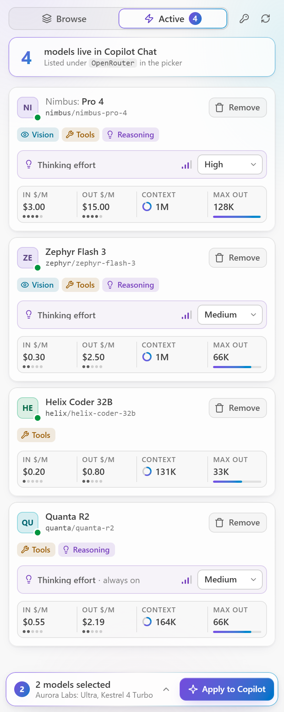

<p align="center">
  
</p>

<h1 align="center">OpenRouter Copilot Model Manager</h1>

<p align="center">
  <b>Browse 400+ <a href="https://openrouter.ai">OpenRouter</a> models and put the ones you want into GitHub Copilot Chat.</b><br/>
  Compare price, context and capabilities, pick a few, and apply them to the Copilot model picker in one click.
</p>

<p align="center">
  <a href="https://marketplace.visualstudio.com/items?itemName=husamettinulutas.openrouter-copilot-model-manager"></a>
  <a href="https://marketplace.visualstudio.com/items?itemName=husamettinulutas.openrouter-copilot-model-manager"></a>
  <a href="https://code.visualstudio.com/"></a>
  <a href="LICENSE"></a>
</p>

<p align="center">
  
</p>

---

## What it does

- **Browse the whole OpenRouter catalog.** Search by name, provider or ID, filter by **Vision**, **Tools**, **Free** and **Reasoning**, pick a provider, and sort by name, price, context or release date.
- **Compare at a glance.** Every model shows its capabilities, input and output price per million tokens, context window and max output, with small meters so you can compare while scanning. In an editor tab the list becomes a sortable table.
- **Add to Copilot in one click.** Select models, then press **Apply to Copilot**. They appear in the Copilot Chat model picker under **OpenRouter**, with no reload and no config file.
- **Manage what is live.** The **Active** tab lists every model in Copilot. Remove one, or set its default **Thinking effort**.
- **Full agent mode in Copilot Chat.** Tool calling, vision input, streamed reasoning, prompt caching, retries with backoff, and token usage and cost in the status bar.
- **Works without a Copilot subscription.** Web fetch, web search, semantic code search, chat titles and commit messages, and inline suggestions all run through OpenRouter. See [Without a Copilot subscription](#without-a-copilot-subscription).
- **See which model answered.** With a router such as `openrouter/auto`, the status bar names the model that actually answered and its provider.
- **Fits anywhere.** The panel follows your VS Code theme (light, dark or high contrast) and works from a narrow sidebar up to a full editor tab.

## Install

Search **OpenRouter Copilot Model Manager** in the VS Code Extensions view, or install a `.vsix`:

```bash
code --install-extension openrouter-copilot-model-manager-1.3.0.vsix
```

Requires VS Code **1.104+** and GitHub Copilot Chat.

## Quick start

1. Open the **OpenRouter Copilot Model Manager** icon in the activity bar.
2. Click the **key** icon and paste your OpenRouter API key. Get one at [openrouter.ai/settings/keys](https://openrouter.ai/settings/keys). It is stored in VS Code **SecretStorage**, never in a file.
3. The catalog loads on its own; click the **sync** icon to refresh it.
4. Find models: press `/` to search, use the filter chips, the provider menu and sort.
5. Press **Select** on the models you want. They wait in the tray at the bottom of the panel.
6. Press **Apply to Copilot** (or `Ctrl+Enter`). Your models are now in the Copilot Chat model picker.

A model that is already in Copilot shows a green **In Copilot** button and an **Active** pill, so you never add it twice. Clicking **In Copilot** removes it again.

### Active in Copilot

<p align="center">
  
</p>

Reasoning models get a **Thinking Effort** submenu in the Copilot model picker, so you can set the reasoning depth per request. The Active tab sets the default for each model, and `openrouterModelManager.defaultReasoningEffort` sets a global fallback.

### Light theme, narrow sidebar

<p align="center">
  
  &nbsp;
  
</p>

### Keyboard

| Key | Action |
| --- | --- |
| `/` | Focus search |
| `Escape` | Clear search, or close the provider menu |
| `Ctrl+Enter` / `⌘+Enter` | Apply drafts to Copilot |
| `←` `→` | Switch between Browse and Active |
| `↑` `↓` | Move through the provider menu |

## Without a Copilot subscription

Copilot Chat works with OpenRouter models without a paid Copilot plan. Several Copilot features still call GitHub's own services, though, and fail or disappear without a subscription. The extension replaces them with OpenRouter:

| Copilot feature | Without a subscription | What this extension adds |
| --- | --- | --- |
| Fetch a web page (`#fetch`) | Fails with *"Your subscription has ended"* when you are signed in with a lapsed plan | **Fetch Web Page (OpenRouter)** tool, `#openrouterFetch`. On by default. |
| Web search | Copilot has none for OpenRouter models | OpenRouter web search with sources under the answer. Run **OpenRouter: Toggle Web Search**. About $0.007 per search with Exa. |
| Semantic code search (`#codebase`) | Not offered to OpenRouter models | **Codebase Search (OpenRouter)** tool, `#openrouterCodebase`. The first use asks before indexing the workspace; indexing a typical repository costs under a cent. `.env` and key files are never sent. |
| Chat titles, commit messages, rename suggestions, repairing failed edits | Fail, or quietly do nothing | Run **OpenRouter: Choose Utility Model for Copilot** (the extension also offers it once). It points `chat.utilityModel` and `chat.utilitySmallModel` at a small OpenRouter model. |
| Inline suggestions (ghost text) | Not available | Run **OpenRouter: Toggle Inline Completions**. Off by default, because every suggestion is a paid request. Codestral answers in about a second. |
| Searching other GitHub repositories (`github_repo`) | Fails | Not covered. Add the [GitHub MCP server](https://github.com/github/github-mcp-server) with a personal access token. |

**If your Copilot subscription has ended, sign out of GitHub in VS Code** (Accounts menu → your GitHub account → Sign Out). Copilot treats a signed-in account without a plan more strictly than no account at all: signed out, OpenRouter models are fully supported and Copilot stops asking for a subscription.

Some Copilot extras cannot be replaced from an extension and stay unavailable without a plan: thinking-section titles, the goal summary badge, "explain changes" for edits and dictation cleanup.

## Commands

| Command | Description |
| --- | --- |
| `OpenRouter: Browse Models` | Open the model browser in an editor tab |
| `OpenRouter: Set API Key` | Set or update your OpenRouter API key |
| `OpenRouter: Sync Models from API` | Fetch the latest model catalog |
| `OpenRouter: Choose Utility Model for Copilot` | Pick the model for chat titles, commit messages and edit repair |
| `OpenRouter: Toggle Web Search` | Let models search the web while answering |
| `OpenRouter: Toggle Inline Completions` | Inline code suggestions from an OpenRouter model |
| `OpenRouter: Rebuild Codebase Search Index` | Index the workspace again from scratch |
| `OpenRouter: Delete Codebase Search Index` | Delete this workspace's local search index |

## Settings

All settings are under `openrouterModelManager.*`:

| Setting | Default | Description |
| --- | --- | --- |
| `cache.ttlMinutes` | `60` | Minutes before the model cache is refreshed |
| `requestTimeoutSeconds` | `60` | Request timeout in seconds |
| `maxRetries` | `3` | Retries for rate limits and server errors |
| `defaultTemperature` | *(model default)* | Temperature from 0.0 to 2.0 |
| `defaultMaxTokens` | *(model default)* | Maximum output tokens |
| `defaultReasoningEffort` | *(model default)* | Thinking effort when Copilot has not set one: `none`, `minimal`, `low`, `medium`, `high`, `xhigh` or `max` |
| `maxInputTokensOverride` | *(auto)* | Caps the context size reported to Copilot, so compaction starts earlier |
| `apiEndpoint` | `https://openrouter.ai/api/v1` | Custom API endpoint or proxy |
| `enablePromptCaching` | `true` | OpenRouter prompt caching; cuts input-token costs in agent mode |
| `enableStreamUsage` | `true` | Request token usage while streaming; turn off if a provider answers `invalid_json` |
| `sanitizeBase64Content` | `true` | Strip long base64 blobs from prompts so guardrails do not block them; images are not affected |
| `logLevel` | `info` | Output-channel verbosity: `debug`, `info`, `warn` or `error` |
| `utilityModel` | *(none)* | OpenRouter model for chat titles, commit messages and edit repair; set it with the command |
| `webSearch.enabled` | `false` | Let models that call tools search the web |
| `webSearch.engine` | `exa` | `exa` (about $0.007 per search), `parallel` (about $0.001, results can be stale), `native` or `auto` |
| `webSearch.maxResults` | `3` | Results per search |
| `webSearch.showSources` | `true` | List the pages an answer used under it |
| `codebaseSearch.embeddingModel` | `openai/text-embedding-3-small` | Embedding model for codebase search |
| `codebaseSearch.maxFiles` | `3000` | Most files to index per workspace |
| `inlineCompletions.enabled` | `false` | Inline suggestions from OpenRouter |
| `inlineCompletions.model` | `mistralai/codestral-2508` | Model for inline suggestions |
| `inlineCompletions.debounceMs` | `350` | Typing pause before a suggestion is requested |

The API key can also come from the `OPENROUTER_API_KEY` environment variable when none is stored.

## Supported capabilities

| Capability | Status |
| --- | --- |
| Chat (text to text) | ✅ |
| Tool calling (agent mode) | ✅ |
| Web fetch, web search and codebase search without a Copilot subscription | ✅ |
| Utility model for titles and commit messages | ✅ |
| Inline suggestions (opt-in) | ✅ |
| Vision / image input | ✅ |
| Thinking / reasoning display | ✅ |
| Thinking effort picker | ✅ |
| Streaming | ✅ |
| Retry with backoff | ✅ |
| Usage statistics | ✅ |

## Development

```bash
npm install
npm run watch      # esbuild in watch mode, then press F5 for an Extension Development Host
npm test           # unit tests
npm run build      # production bundle
npm run package    # build a .vsix
```

## Credits

The Copilot model-picker **Thinking Effort** integration was adapted from [@Irvingouj](https://github.com/Irvingouj)'s fork ([`c2dc1de`](https://github.com/Irvingouj/openrouter-copilot-model-manager/commit/c2dc1de61a44ee6504f9c3d2de21b81f3cc1cbc6)), with the model-id heuristic removed and without enabling proposed APIs, so this build stays installable from the Marketplace on stable VS Code.

## License

MIT. See [LICENSE](LICENSE).
